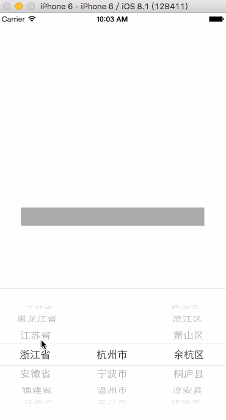

# CityPickView(城市选择器)

#####cityPickView for ios oc.


####本人小白，因项目需要写了一个城市选择器，在demo里有详细的使用方法，使用block返回所选择的城市信息。如有错误的地方请指正，谢谢O(∩_∩)O谢谢

把CityPickView拖入工程中。


```
	#import "CityPickView.h"
    CityPickView *cityPickView = [[CityPickView alloc] initWithFrame:CGRectMake(0, 0, self.view.frame.size.width, 256)];
    cityPickView.address = @"浙江省-杭州市-余杭区";  //设置默认城市，弹出之后显示的是这个
    cityPickView.toolshidden = NO; //默认是显示的，如不需要，toolsHidden设置为yes
    
    cityPickView.confirmblock = ^(NSString *proVince,NSString *city,NSString *area){
		//每次滚动结束都会返回值
    };
    
    cityPickView.doneBlock = ^(NSString *proVince,NSString *city,NSString *area){
		//点击确定按钮回调
    };
  
    cityPickView.cancelblock = ^(){
	    //点击取消按钮回调
    };
```


